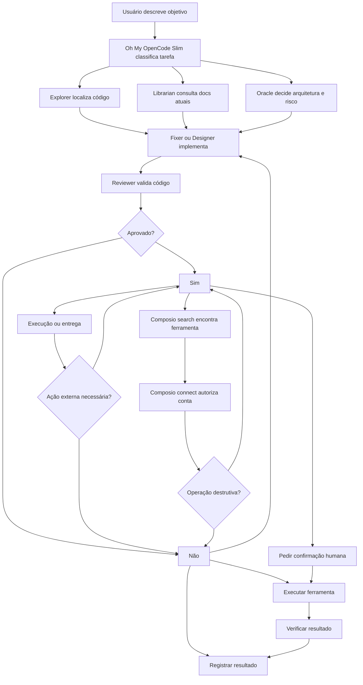

# Transferência: Composio + Oh My OpenCode Slim

Guia para reproduzir ambiente de agentes em outro PC.

## Escopo

Este documento transfere somente ferramentas de agente:

- **OpenCode**: harness principal.
- **Oh My OpenCode Slim**: orquestração, agentes especializados e delegação.
- **Composio CLI**: descoberta, conexão e execução de ferramentas externas.

Não transfere:

- Senhas, tokens ou chaves.
- Arquivo `.env`.
- Banco de dados.
- Logs, screenshots, traces ou vídeos de teste.
- Bypass local de autenticação.
- Mudanças de lógica do Bora.

## 1. Pré-requisitos

Verifique versões:

```bash
opencode --version
node --version
bun --version
```

Se OpenCode não estiver instalado, seguir documentação oficial:

```text
https://opencode.ai/docs
```

Oh My OpenCode Slim aceita `npx`. Bun é opcional.

## 2. Instalar Oh My OpenCode Slim

### Instalação não interativa

```bash
npx --yes oh-my-opencode-slim@latest install --no-tui --skills=yes --background-subagents=yes
```

Ou, com Bun:

```bash
bunx oh-my-opencode-slim@latest install --no-tui --skills=yes --background-subagents=yes
```

Instalador normalmente:

- Registra plugin em `opencode.json` ou `opencode.jsonc`.
- Cria `oh-my-opencode-slim.json` ou `.jsonc`.
- Configura modelos dos agentes.
- Habilita skills incluídas.
- Configura background subagents.
- Faz backup antes de usar `--reset`.

### Autenticar providers

```bash
opencode auth login
opencode models --refresh
```

### Verificar

```bash
opencode
```

Dentro do OpenCode:

```text
ping all agents
```

Também pode validar pelo terminal:

```bash
npx --yes oh-my-opencode-slim@latest doctor
```

### Configuração local

Unix, Linux, macOS ou WSL:

```text
~/.config/opencode/opencode.json
~/.config/opencode/oh-my-opencode-slim.json
```

Windows:

```text
%USERPROFILE%\.config\opencode\opencode.json
%USERPROFILE%\.config\opencode\oh-my-opencode-slim.json
```

Configuração pode usar `.jsonc` para comentários.

## 3. Instalar Composio CLI

### Linux, macOS ou WSL

```bash
curl -fsSL https://composio.dev/install | sh
composio login
```

Para configurar agentes compatíveis:

```bash
composio setup --target auto
```

Verificar:

```bash
composio --version
composio search "enviar email"
composio links
```

### Windows nativo

Composio CLI não suporta Windows nativo. Não executar comando POSIX diretamente no PowerShell.

Instalar WSL:

```powershell
wsl --install
```

Reiniciar Windows se solicitado. Depois abrir_distribution Linux e executar:

```bash
curl -fsSL https://composio.dev/install | sh
composio login
composio setup --target auto
```

Fluxo alternativo sem CLI:

- Usar SDK TypeScript `@composio/core`.
- Usar sessão/MCP do Composio.
- Manter autenticação fora do repositório.

## 4. Configuração background

Oh My OpenCode Slim usa background subagents. Em Unix:

```bash
export OPENCODE_EXPERIMENTAL_BACKGROUND_SUBAGENTS=true
export OPENCODE_ENABLE_EXA=1
```

```bash
export OPENCODE_EXPERIMENTAL_BACKGROUND_SUBAGENTS=true
export OPENCODE_ENABLE_EXA=1
opencode
```

Instalador pode gravar variáveis em `~/.bashrc`, `~/.zshrc` ou profile equivalente. Reiniciar terminal após alterar shell.

Validar:

```bash
echo $OPENCODE_EXPERIMENTAL_BACKGROUND_SUBAGENTS
echo $OPENCODE_ENABLE_EXA
```

## 5. Fluxo lógico combined



### Separação responsabilidades

- **Oh My OpenCode Slim**: Coordena agentes, divide trabalho e revisa resultado.
- **Explorer**: encontra arquivos, rotas e padrões.
- **Librarian**: busca documentação atual.
- **Oracle**: analisa arquitetura, lógica e risco.
- **Fixer**: implementação escopada.
- **Designer**: UI/UX.
- **Reviewer**: quality gate.
- **Composio**: conecta agente a serviços externos.

## 6. Fluxo recomendado para bugs do Bora

```text
1. Ler sinais de operação
2. Correlacionar venda, produto, estoque, caixa e promotion
3. Deduplicar por fingerprint
4. Classificar severidade
5. Enriquecer com tenant, user, resource e request ID
6. Reproduzir em ambiente de teste
7. Criar issue técnica
8. Notificar responsável
9. Corrigir
10. Rodar regressão
11. Validar impacto
12. Encerrar ou reabrir bug
```

Regras iniciais:

- `stock < 0` após venda: crítico.
- Venda sem baixa de estoque: crítico.
- Compra aprovada sem recebimento: alto.
- Promoção com preço divergente: alto.
- Recurso de empresa acessado por outra empresa: crítico.
- Mesmo erro 3 vezes em 5 minutos: alto.
- Erro de API por 10 minutos: incidente.

## 7. Aplicar em outro PC

### Passo 1 — Clonar projeto

```bash
git clone <URL_DO_REPOSITORIO>
cd <PASTA_DO_PROJETO>
```

### Passo 2 — Instalar OpenCode

```bash
opencode --version
```

### Passo 3 — Instalar Oh My OpenCode Slim

```bash
npx --yes oh-my-opencode-slim@latest install --no-tui --skills=yes --background-subagents=yes
opencode auth login
opencode models --refresh
```

### Passo 4 — Reiniciar terminal

```bash
source ~/.bashrc
```

Ou fechar e abrir terminal novamente.

### Passo 5 — Instalar Composio

WSL/Linux/macOS:

```bash
curl -fsSL https://composio.dev/install | sh
composio login
composio setup --target auto
```

### Passo 6 — Validar agentes

```bash
opencode
```

```text
ping all agents
```

### Passo 7 — Validar Composio

```bash
composio search "criar issue no GitHub"
composio links
```

Conectar somente conta necessária. Composio deve pedir autorização no navegador.

### Passo 8 — Reiniciar OpenCode

Configuração de plugin, skills, modelos e MCP pode exigir novo processo.

```bash
opencode
```

## 8. Troubleshooting

### Oh My OpenCode Slim não carrega

```bash
opencode --version
opencode auth status
npx --yes oh-my-opencode-slim@latest doctor
```

Verificar:

```text
~/.config/opencode/opencode.json
~/.config/opencode/oh-my-opencode-slim.json
```

### Background agents não funcionam

```bash
echo $OPENCODE_EXPERIMENTAL_BACKGROUND_SUBAGENTS
echo $OPENCODE_ENABLE_EXA
```

Esperado:

```text
true
1
```

Reiniciar terminal e OpenCode.

### Composio não conecta

```bash
composio --version
composio links
composio login
```

No Windows nativo, usar WSL.

### Ferramenta não aparece

```bash
composio search "ação desejada"
```

Depois conectar toolkit e repetir busca.

## 9. Segurança

- Nunca commitar `.env`.
- Nunca colar senha ou token em README.
- Nunca usar bypass em produção.
- Manter bypass apenas temporário e local quando necessário.
- Exigir confirmação antes de criar, alterar ou excluir dados externos.
- Revisar permissões de agents e MCPs.
- Usar contas de teste para E2E.
- Rotacionar credenciais expostas em chat, logs ou screenshots.

## 10. Resultado esperado

Outro PC deve conseguir:

```text
1. Abrir projeto
2. Iniciar OpenCode
3. Usar agentes Oh My OpenCode Slim
4. Autenticar providers
5. Autenticar Composio
6. Conectar ferramentas necessárias
7. Executar fluxo de leitura, análise, issue e notificação
8. Revisar e confirmar operações destrutivas
```

Referências:

- Composio CLI: `https://docs.composio.dev/docs/cli`
- Oh My OpenCode Slim: `https://github.com/alvinunreal/oh-my-opencode-slim`
- OpenCode: `https://opencode.ai/docs`
